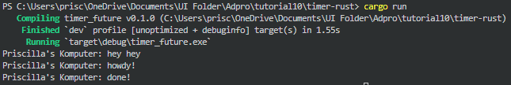
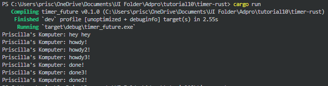
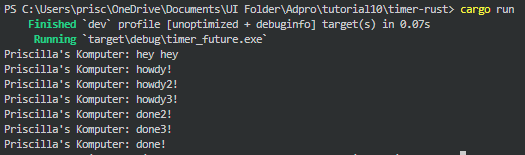
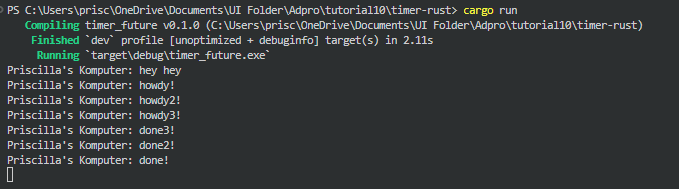

# Advprog Tutorial 10 - Timer
## Priscilla Natanael Surjanto - 2306152153

### 1.2 Understanding how it works

Fungsi utama `main()` pertama-tama membuat eksekutor dan spawner, kemudian menggunakan `spawner.spawn` untuk mengeksekusi tugas asinkron yang mencetak "howdy!", menunggu selama 2 detik menggunakan `TimerFuture::new(Duration::new(2, 0))`, dan setelah itu mencetak "done!". Sementara itu, program akan langsung mencetak "hey hey" karena berada di luar tugas yang dipanggil oleh `spawn`. `TimerFuture` bekerja dengan cara menjalankan thread terpisah yang tidur selama durasi yang ditentukan dan kemudian mengubah status internalnya menjadi "completed". Begitu selesai, thread tersebut memberi tahu tugas untuk melanjutkan eksekusinya melalui `waker`. Output yang dihasilkan seperti ini karena sifat asinkron dari eksekusi tugas, di mana tugas utama tidak terblokir dan bisa menjalankan kode lainnya, sementara tugas yang dipanggil dengan `spawn` berjalan secara bersamaan dan menyelesaikan tugas setelah 2 detik, yang akhirnya mencetak "done!".

### 1.3 Multiple Spawn and Removing Drop
#### Menggunakan `drop(spawner)`

Kedua hasil di atas merupakan hasil setelah menambahkan beberapa spawn lainnya dan masih menggunakan `drop(spawner)`. Hasil berupa pesan "hey hey" tetap ditampilkan paling pertama, kemudian langsung diikuti semua pesan "howdy", baru setelah berhenti sejenak selama 2 detik, semua pesan "done" ditampilkan. Ini disebabkan drop(spawner) memberitahu eksekutor bahwa tidak ada lagi perintah yang akan dijalankan, sehingga eksekutor mulai memproses dan menjalankan tugas yang ada. Semua pesan "howdy" dicetak hampir bersamaan karena tugas-tugas tersebut berjalan secara paralel setelah di-spawn. Setiap tugas kemudian menunggu selama 2 detik menggunakan TimerFuture, dan begitu tugas selesai, pesan "done", "done2", dan "done3" dicetak sesuai urutan penyelesaian tugas. Dengan kata lain, meskipun tugas-tugas asinkron dimulai hampir bersamaan, output "done" muncul setelah semua tugas selesai menunggu secara paralel.

#### Tidak menggunakan `drop(spawner)`

Setelah `drop(spawner)` dihilangkan, maka program akan terus menjalankan tugas-tugas asinkron yang telah di-spawn. Hasilnya akan seperti yang terlihat pada gambar, pesan "hey hey" tetap muncul terlebih dahulu, diikuti dengan pesan "howdy", "howdy2", "howdy3", dan seterusnya. Semua pesan "howdy" muncul hampir bersamaan karena tugas-tugas tersebut dijalankan secara paralel tanpa ada pembatasan dari drop(spawner). Setelah tugas-tugas selesai menunggu selama 2 detik menggunakan TimerFuture, masing-masing tugas mencetak pesan "done", "done2", dan "done3" secara bersamaan. Tanpa drop(spawner), spawner tetap aktif dan dapat terus menambahkan tugas baru, yang menyebabkan eksekusi tugas asinkron berjalan tanpa batas, menghasilkan semua pesan tersebut pada saat yang hampir bersamaan.